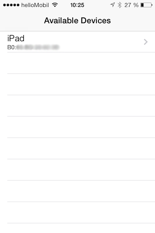
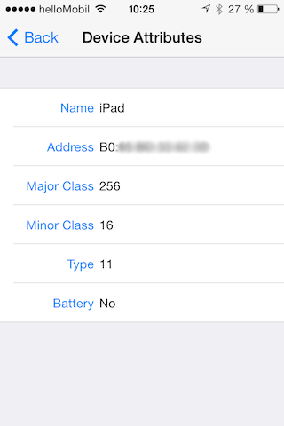

#BeeTee

Demo application for Bluetooth device scanning using the iOS private framework "BluetoothManager"

  

##Abstract

Because it is not trivial to use a private iOS framework, I implemented a demo application for the `BluetoothManager.framework` in iOS 7. I have not used the ARC.

Based on the [AppStore guideline §2.5](https://developer.apple.com/appstore/resources/approval/guidelines.html) not to use private (undocumented) functions it is not possible to publish apps with the `BluetoothManager.framework` in the AppStore. You may need a valid membership of the [iOS Developer Program](https://developer.apple.com/programs/ios/), because it makes sense that this app and framework does not work in the simulator.

##Requirements for this app

* iOS 7 and greater
* iOS 7 compatible device (does not working on the simulator)
* Xcode 5 and greater
* Correctly placed header files (see Preparations)

Except the GUI the app and the framework as well works also fine for iOS 5 and 6. But take care about the path (see next paragraph).

##Preparations

Just to clearify: Of course, since they are just two header files, it does not matter actually where the header files are placed in your project. But if you want to use the `BluetoothManager.framework` in other projects, it makes life easier just to import  the framework with the headers. 

* Find the folder, e.g. by terminal
<pre><code>open /Applications/Xcode.app/Contents/Developer/Platforms/iPhoneOS.platform/Developer/SDKs/iPhoneOS7.0.sdk/System/Library/PrivateFrameworks/BluetoothManager.framework</code></pre>
* Extract the [Headers.zip](/Headers.zip) archive and add the extracted folder `Headers` which includes `BluetoothManager.h` and `BluetoothDevice.h` in the directory above.
* Restart Xcode
* Now you will find the `BluetoothManager.framework` in Targets → YourApp → Build Phases → Link Binary With Libraries:

The folder can differ: Please take care about your iOS version!

For iOS 8 or later you can use [a new bash script](/checkheaders.sh). This bash script checks if you have put your files correctly. just run it in the terminal with
`bash path/to/the/bashscript/checkheaders.sh`

##The BluetoothManager.framework

####Available Notifications
    BluetoothAvailabilityChangedNotification
    BluetoothDiscoveryStateChangedNotification

    BluetoothDeviceDiscoveredNotification
    BluetoothDeviceRemovedNotification
    
    // more methods they are not used in this app
    BluetoothPowerChangedNotification
    BluetoothConnectabilityChangedNotification
    BluetoothDeviceUpdatedNotification

    BluetoothDeviceConnectSuccessNotification
    BluetoothConnectionStatusChangedNotification
    BluetoothDeviceDisconnectSuccessNotification

####Usage

Can be used e.g. 
<pre><code>[[NSNotificationCenter defaultCenter] addObserver:self selector:@selector(bluetoothAvailabilityChanged:) name:@"BluetoothAvailabilityChangedNotification" object:nil];</code></pre>
and 
<pre><code>- (void)bluetoothAvailabilityChanged:(NSNotification *)notification { ... }</code></pre>

##Problemsolving
If you have problems make this project running have a look at [Stackoverflow](http://stackoverflow.com/search?q=beetee). If you have other questions or suggestions, feel free to contact me here in GitHub or somehow else. :-)

##Licence
GPL (v3)

